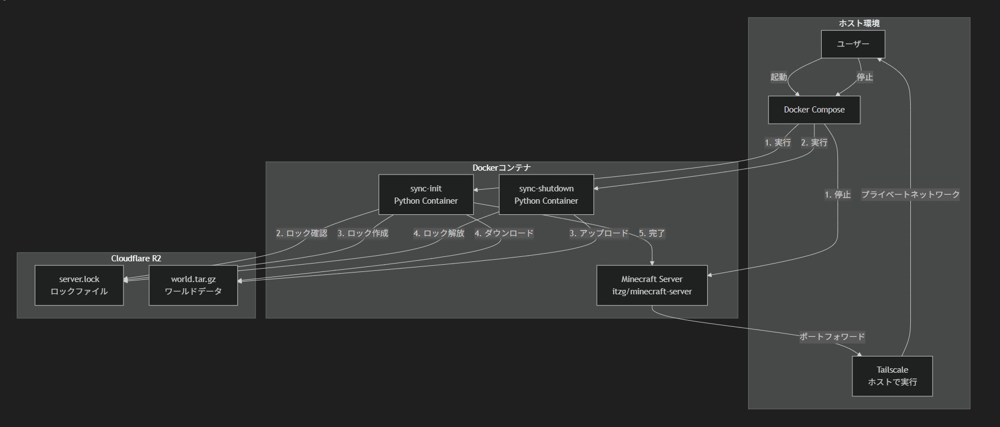

# Minecraft Server with Cloudflare R2 World Sync

Dockerコンテナ上でMinecraftサーバーを立ち上げ、Cloudflare R2を使って複数のホスト間でワールドデータを共有するシステムです。

## 友人へ
リポジトリをクローン後、こちらから提供する環境変数を直下に配置。
winならバッチファイル，unixならシェルスクリプトで起動・停止が出来ます(勝手に同期します)。
Tailscaleの接続は各自調べるか聞いてください。

## とりあえずできること

- 🔒 **ロック機構**: R2上のロックファイルで同時起動を防止
- 🔄 **自動同期**: サーバー起動時にワールドをダウンロード、停止時にアップロード
- 📺 **ホスト表示**: 現在のホストをゲーム内bossbarで全プレイヤーに表示
- 🖥️ **クロスプラットフォーム**: Windows/Linux両対応
- 🐳 **Docker統合**: バッチファイルで起動・停止
- 🌐 **Tailscale対応**: ポート開放不要でプライベートネットワーク経由で接続

### 簡単な原理



## 前提条件

- Docker & Docker Compose (必須)
- Tailscale (必須)
- Cloudflare R2アカウント (クライアント側は不要)

## セットアップ

### 1. Cloudflare R2の準備(引継ぎの場合は不要)

#### R2バケットの作成
1. [Cloudflare Dashboard](https://dash.cloudflare.com/) にログイン
2. **R2** > **Create bucket** をクリック
3. バケット名を入力（例: `minecraft-world-data`）
4. リージョンは自動選択でOK

#### API Tokenの作成
1. **R2** > **Manage R2 API Tokens** をクリック
2. **Create API Token** をクリック
3. 権限を設定:
   - **Object Read & Write** - ワールドデータの読み書き
   - **Bucket Read** - バケット情報の取得
4. 作成後、以下の情報をメモ:
   - Access Key ID
   - Secret Access Key
   - Account ID（ダッシュボードのURLから確認可能）

### 2. 環境変数の設定

`.env.example`をコピーして`.env`ファイルを作成:

```bash
# Windows (PowerShell)
Copy-Item .env.example .env

# Linux/Mac
cp .env.example .env
```

`.env`ファイルを編集してR2の認証情報を入力:

```env
R2_ACCOUNT_ID=your_account_id_here
R2_ACCESS_KEY_ID=your_access_key_id_here
R2_SECRET_ACCESS_KEY=your_secret_access_key_here
R2_BUCKET_NAME=minecraft-world-data
R2_ENDPOINT=https://your_account_id_here.r2.cloudflarestorage.com
LOCAL_DATA_DIR=./data
HOST_DISPLAY_NAME=YourName
RCON_PASSWORD=minecraft
```

## 使い方

### サーバーの起動

#### Windows
```cmd
start-server.bat
```

#### Linux/Mac
```bash
chmod +x start-server.sh
./start-server.sh
```

#### 手動起動
```bash
docker compose up -d
```

起動時の処理:
1. R2からロック状態を確認
2. ロックが存在しない場合、ロックを作成
3. R2からワールドデータをダウンロード（存在する場合）
4. Minecraftサーバーを起動

### サーバーの停止

#### Windows
```cmd
stop-server.bat
```

#### Linux/Mac
```bash
./stop-server.sh
```

#### 手動停止
```bash
docker compose down
docker compose run --rm sync-shutdown
```

停止時の処理:
1. Minecraftサーバーを停止
2. ワールドデータをR2にアップロード
3. ロックを解放

### ログの確認

#### サーバーログ
```bash
# リアルタイムでログを追跡（Ctrl+Cで終了）
docker logs -f mc_server

# 最新50行を表示
docker logs mc_server --tail 50

# サーバー起動完了を確認（"Done"メッセージを検索）
docker logs mc_server 2>&1 | Select-String "Done"
```

#### 同期ログ
```bash
# 起動時の同期ログ
docker logs mc_sync_init

# 停止時の同期ログ
docker logs mc_sync_shutdown
```

#### コンテナ状態確認
```bash
# 実行中のコンテナ一覧
docker ps

# Minecraftサーバー関連のコンテナ（停止中も含む）
docker ps -a --filter "name=mc_"

# ポート確認
docker port mc_server
```

### 開発環境

本番のR2バケットに影響を与えずに開発・テストしたい場合、専用の環境ファイルを使って起動できます。

```bash
# .env.example をコピーして開発用環境ファイルを作成
cp .env.example .env.dev

# .env.dev を編集: 開発用バケット名を設定
# 必要に応じて MC_PORT を変更（本番と同時起動する場合）

# 開発環境で起動・停止
./start-server.sh dev
./stop-server.sh dev
```

Windows の場合:
```cmd
start-server.bat dev
stop-server.bat dev
```

## ロック機構について

### ロックの仕組み

- サーバー起動時にR2上に`server.lock`ファイルを作成
- ロックファイルには起動したホスト名とタイムスタンプを記録
- 既にロックが存在する場合、起動を中止してエラーを表示
- サーバー停止時にロックを自動削除

### ロックの強制解除

サーバーが異常終了してロックが残ってしまった場合:

1. **Cloudflare Dashboard経由**:
   - R2バケットを開く
   - `server.lock`ファイルを削除

2. **コマンドライン経由**:
   ```bash
   docker compose run --rm sync-init ruby /app/sync.rb unlock
   ```

### ロック状態の確認

```bash
docker compose run --rm sync-init ruby /app/sync.rb check-lock
```

## ディレクトリ構造

```
 mc-server/
 ├── data/                    # Minecraftサーバーデータ(自動生成)
 │   ├── world/               # ワールドデータ
 │   ├── world_nether/        # ネザー
 │   ├── world_the_end/       # エンド
 │   ├── server.properties    # サーバー設定
 │   └── ...                  # その他の設定ファイル
 ├── datapack/                # データパック
 │   └── host_bossbar/        # ホスト表示用データパック
 │       ├── pack.mcmeta      # データパックメタデータ
 │       └── data/
 │           └── host_bossbar/
 │               ├── functions/
 │               │   ├── load.mcfunction    # 初期化処理
 │               │   └── tick.mcfunction    # 定期更新処理
 │               └── tags/
 │                   └── functions/
 │                       └── load.json      # ロード設定
 ├── docker/                  # Dockerファイル
 │   └── ruby/
 │       └── Dockerfile       # Rubyカスタムイメージ
 ├── docs/                    # ドキュメント・画像
 │   └── diagram.png          # システム構成図
 ├── scripts/                 # スクリプト
 │   ├── sync.rb              # R2同期スクリプト
 │   └── bossbar.rb           # ホスト表示bossbar管理スクリプト
 ├── compose.yml              # Docker Compose設定
 ├── start-server.bat         # サーバー起動スクリプト(Windows)
 ├── start-server.sh          # サーバー起動スクリプト(Linux/Mac)
 ├── stop-server.bat          # サーバー停止スクリプト(Windows)
 └── stop-server.sh           # サーバー停止スクリプト(Linux/Mac)

## セキュリティ

- `.env`ファイルは**絶対に**Gitにコミットしないでください
- R2 API Tokenは適切に管理してください
- 必要最小限の権限でAPI Tokenを作成してください