# Minecraft Server with Cloudflare R2 World Sync

Dockerコンテナ上でMinecraftサーバーを立ち上げ、Cloudflare R2を使って複数のホスト間でワールドデータを共有するシステムです。

## 友人へ
リポジトリをクローン後、こちらから提供する環境変数を直下に配置。
winならバッチファイル，unixならシェルスクリプトで起動・停止が出来ます(勝手に同期します)。
Tailscaleの接続は各自調べるか聞いてください。

## とりあえずできること

- 🔒 **ロック機構**: R2上のロックファイルで同時起動を防止
- 🔄 **自動同期**: サーバー起動時にワールドをダウンロード、停止時にアップロード
- 🖥️ **クロスプラットフォーム**: Windows/Linux両対応
- 🐳 **Docker統合**: `docker compose`で簡単に起動・停止
- 🌐 **Tailscale対応**: ポート開放不要でプライベートネットワーク経由で接続

### 簡単な原理

```mermaid
graph TB
    subgraph "ホスト環境"
        User[ユーザー]
        Tailscale[Tailscale<br/>ホストで実行]
        Docker[Docker Compose]
    end
    
    subgraph "Dockerコンテナ"
        SyncInit[sync-init<br/>Python Container]
        MCServer[Minecraft Server<br/>itzg/minecraft-server]
        SyncShutdown[sync-shutdown<br/>Python Container]
    end
    
    subgraph "Cloudflare R2"
        Lock[server.lock<br/>ロックファイル]
        World[world.tar.gz<br/>ワールドデータ]
    end
    
    User -->|起動| Docker
    Docker -->|1. 実行| SyncInit
    SyncInit -->|2. ロック確認| Lock
    SyncInit -->|3. ロック作成| Lock
    SyncInit -->|4. ダウンロード| World
    SyncInit -->|5. 完了| MCServer
    MCServer -->|ポートフォワード| Tailscale
    Tailscale -->|プライベートネットワーク| User
    
    User -->|停止| Docker
    Docker -->|1. 停止| MCServer
    Docker -->|2. 実行| SyncShutdown
    SyncShutdown -->|3. アップロード| World
    SyncShutdown -->|4. ロック解放| Lock
```


## 前提条件

- Docker & Docker Compose (必須)
- Tailscale (必須)
- Python 3.11以上（ローカルでスクリプトを実行する場合）
- Cloudflare R2アカウント (クライアント側は不要)

## セットアップ

### 1. Cloudflare R2の準備(引継ぎの場合は不要)

#### R2バケットの作成
1. [Cloudflare Dashboard](https://dash.cloudflare.com/) にログイン
2. **R2** > **Create bucket** をクリック
3. バケット名を入力（例: `minecraft-world-data`）
4. リージョンは自動選択でOK

#### API Tokenの作成
1. **R2** > **Manage R2 API Tokens** をクリック
2. **Create API Token** をクリック
3. 権限を設定:
   - **Object Read & Write** - ワールドデータの読み書き
   - **Bucket Read** - バケット情報の取得
4. 作成後、以下の情報をメモ:
   - Access Key ID
   - Secret Access Key
   - Account ID（ダッシュボードのURLから確認可能）

### 2. 環境変数の設定

`.env.example`をコピーして`.env`ファイルを作成:

```bash
# Windows (PowerShell)
Copy-Item .env.example .env

# Linux/Mac
cp .env.example .env
```

`.env`ファイルを編集してR2の認証情報を入力:

```env
R2_ACCOUNT_ID=your_account_id_here
R2_ACCESS_KEY_ID=your_access_key_id_here
R2_SECRET_ACCESS_KEY=your_secret_access_key_here
R2_BUCKET_NAME=minecraft-world-data
R2_ENDPOINT=https://your_account_id_here.r2.cloudflarestorage.com
LOCAL_DATA_DIR=./server001/data
WORLD_NAME=world
```

### 3. Python依存関係のインストール（任意）

Dockerを使う場合は不要ですが、ローカルでスクリプトを実行する場合:

```bash
pip install -r requirements.txt
```

## 使い方

### サーバーの起動

#### Windows
```cmd
start-server.bat
```

#### Linux/Mac
```bash
chmod +x start-server.sh
./start-server.sh
```

#### 手動起動
```bash
docker compose -f server001/compose.yml up -d
```

起動時の処理:
1. R2からロック状態を確認
2. ロックが存在しない場合、ロックを作成
3. R2からワールドデータをダウンロード（存在する場合）
4. Minecraftサーバーを起動

### サーバーの停止

#### Windows
```cmd
stop-server.bat
```

#### Linux/Mac
```bash
./stop-server.sh
```

#### 手動停止
```bash
docker compose -f server001/compose.yml down
docker compose -f server001/compose.yml run --rm sync-shutdown
```

停止時の処理:
1. Minecraftサーバーを停止
2. ワールドデータをR2にアップロード
3. ロックを解放

### ログの確認

```bash
# サーバーログ
docker logs -f mc_server

# 同期ログ
docker logs mc_sync_init
docker logs mc_sync_shutdown
```

## ロック機構について

### ロックの仕組み

- サーバー起動時にR2上に`server.lock`ファイルを作成
- ロックファイルには起動したホスト名とタイムスタンプを記録
- 既にロックが存在する場合、起動を中止してエラーを表示
- サーバー停止時にロックを自動削除

### ロックの強制解除

サーバーが異常終了してロックが残ってしまった場合:

1. **Cloudflare Dashboard経由**:
   - R2バケットを開く
   - `server.lock`ファイルを削除

2. **コマンドライン経由**:
   ```bash
   python sync.py unlock
   ```

### ロック状態の確認

```bash
python sync.py check-lock
```

## ディレクトリ構造

```
mc-server/
├── server001/
│   ├── compose.yml          # Docker Compose設定
│   └── data/                # Minecraftサーバーデータ（自動生成）
│       └── world/           # ワールドデータ
├── sync.py                  # R2同期スクリプト
├── requirements.txt         # Python依存関係
├── .env                     # 環境変数（要作成）
├── .env.example             # 環境変数テンプレート
├── start-server.bat         # Windows起動スクリプト
├── stop-server.bat          # Windows停止スクリプト
├── start-server.sh          # Linux起動スクリプト
├── stop-server.sh           # Linux停止スクリプト
└── README.md                # このファイル
```

## セキュリティ

- `.env`ファイルは**絶対に**Gitにコミットしないでください
- R2 API Tokenは適切に管理してください
- 必要最小限の権限でAPI Tokenを作成してください